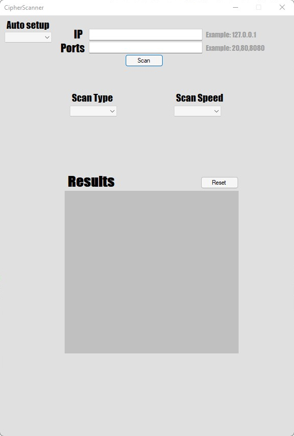
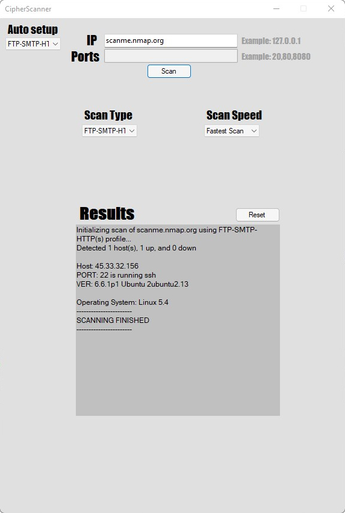
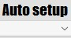
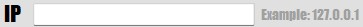
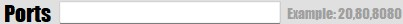
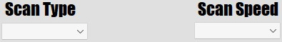

<!-- ABOUT THE PROJECT -->
## About the Cipher Scanner

CipherScanner is a GUI for [SaltwaterTaffy](https://github.com/thomdixon/SaltwaterTaffy) Nmap wrapper library.
Idea of CipherScanner is to make Nmap scanning as simple as possible to users that do not want to spend much time configuring their settings.

What is the difference between Zenmap/Nmap and Cipher Scanner?
* Zenmap/Nmap sometimes can be confusing, and if someone wants to scan a target quickly with strong scan settings they will not really be able to do it without some research or knowledge.
* CipherScanner has two options for the user, automatic settings or manual settings. If user does not have any knowledge and wants the best results quickly, he can use automatic settings and everything will be ready for scan.

Of course, Zenmap/Nmap also has automatic options/profiles, but as mentioned before, they can be confusing sometimes and they might lack some external profile settings like wide port range and similar.

Note - This is my first project on GitHub and since I'm still learning C# there might be some newbie mistakes and bugs.

<!-- GETTING STARTED -->
## Examples

Here are some examples of Cipher Scanner: 
 

<!-- USAGE EXAMPLES -->
## Usage

How to use Cipher Scanner?  

**Automatic Settings**  
 
* By choosing something from the given list, e.g. SSH, then SSH settings will be automatically applied, which means you will not need to think about ports, speed and scan type, then all you have to do is put Targets IP Address/Domain and press SCAN button.

**Manual Settings**  
 
 
 
* Here you will have to put Ports manually, select scan type manually and scan speed. After that is done, make sure you put your Targets IP Address/Domain and press SCAN button.

### Built With

* [C#](https://docs.microsoft.com/en-us/dotnet/csharp/)
* [Winforms](https://docs.microsoft.com/en-us/dotnet/desktop/winforms/?view=netdesktop-6.0)
* [SaltwaterTaffy Nmap Wrapper Library](https://github.com/thomdixon/SaltwaterTaffy)

<!-- CONTRIBUTING -->
## Contributing

Any contributions you make are **greatly appreciated**.

If you have a suggestion that would make this better, please fork the repo and create a pull request.
Don't forget to give the project a star! Thanks again!

<!-- LICENSE -->
## License

See `LICENSE.md` for more information.

<!-- CONTACT -->
## Contact

Email - ib.email365@gmail.com

<!-- ACKNOWLEDGMENTS -->
## Acknowledgments

Resources that helped me build this program:

* [SaltwaterTaffy](https://github.com/thomdixon/SaltwaterTaffy)
* [Nmap](https://nmap.org)
* [StackOverFlow](https://stackoverflow.com)

(<a href="#top">Back to top</a>)

